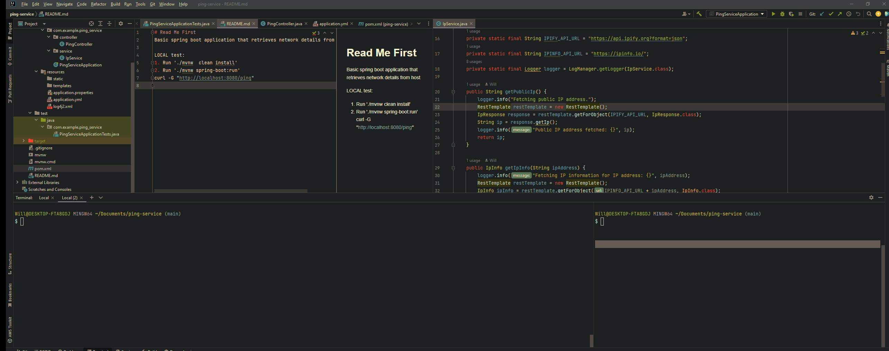

# Read Me First
Basic spring boot application that retrieves network details from host

LOCAL test:
1. Run './mvnw  clean install'
2. Run './mvnw spring-boot:run'
curl -G "http://localhost:8080/ping"

