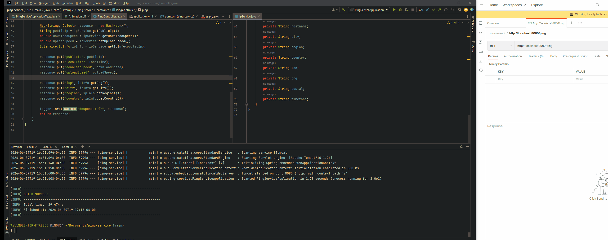

# **Read Me First**

### Basic Spring Boot Application to Retrieve Network Details from Host

---

#### **Local Test Instructions**

1. **Run Build:**
   ```sh
   ./mvnw clean install

2. **Start the application:**
    ```sh
   ./mvnw spring-boot:run
    
3. **Test the Endpoint:**
    ```sh
   curl -G "http://localhost:8080/ping"

#### **DEMO**

